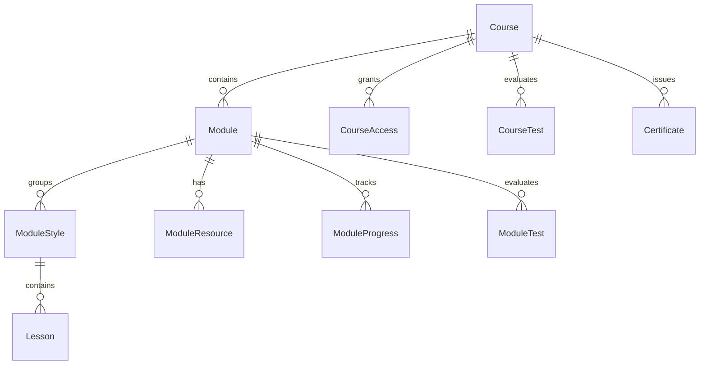

# Academy Content Model

Last updated: 2026-06-21

## Summary

The academy content hierarchy is now:

1. Course
2. Module / section
3. ModuleStyle
4. Lesson

`ModuleStyle` is a visible grouping inside each module. It is editable by admins and displayed to students as a heading above its lessons. It is not a student track, filter, or access boundary. Course access, rental expiration, module progress, evaluations, resources, comments, likes, chat, and certificates continue to work at the same course/module level as before.

## Entity Diagram



## Prisma Rules

### ModuleStyle

`ModuleStyle` lives between `Module` and `Lesson`.

- `moduleId`: parent module.
- `name`: visible label, for example `General`, `Rizos`, `Lacio`, `Ondulado`, `Afro`.
- `slug`: unique per module.
- `order`: display order inside the module.
- `description`: optional admin/student context.
- `isActive`: inactive styles are hidden from the student API.
- `lessons`: nested lessons.

Constraints:

- `moduleId + slug` is unique.
- `moduleId + order` is unique.
- `styleId + order` is unique for lessons.

### Lesson

`Lesson` belongs canonically to `ModuleStyle` through `styleId`.

`Lesson.moduleId` remains as a temporary denormalized legacy column so old module-based APIs and existing progress logic can keep working while the UI and integrations move to style-based APIs.

## Migration Rules

Migration `20260621160000_add_module_styles` performs the compatibility move:

1. Create `ModuleStyle`.
2. Create one style named `General` for every existing module.
3. Backfill every existing lesson into the `General` style of its module.
4. Set `Lesson.styleId` as required.
5. Replace lesson ordering uniqueness from `moduleId + order` to `styleId + order`.
6. Keep `Lesson.moduleId` for legacy endpoints and reporting.

The seed does the same fallback behavior for demo data: every demo module gets `General`, and if a module has no lessons, a first lesson is created from the module title/video/transcript.

## API Surface

### Admin styles

- `GET /api/admin/modules/[moduleId]/styles`
  - Lists styles for a module with nested lessons.
- `POST /api/admin/modules/[moduleId]/styles`
  - Creates a style.
- `PUT /api/admin/modules/[moduleId]/styles/[styleId]`
  - Updates name, description, order, or active status.
- `DELETE /api/admin/modules/[moduleId]/styles/[styleId]`
  - Deletes a style and its lessons.
  - The API refuses to delete the only style in a module.

### Admin lessons by style

- `GET /api/admin/styles/[styleId]/lessons`
  - Lists lessons in one style.
- `POST /api/admin/styles/[styleId]/lessons`
  - Creates a lesson inside that style.
- `PUT /api/admin/styles/[styleId]/lessons/[lessonId]`
  - Updates a lesson.
- `DELETE /api/admin/styles/[styleId]/lessons/[lessonId]`
  - Deletes a lesson.

### Student styles

- `GET /api/student/modules/[moduleId]/styles`
  - Requires authenticated course access.
  - Returns active styles with nested lessons.
  - If the course rental expired, lesson video URLs are returned as `null`.

### Legacy lesson aliases

These endpoints remain temporarily to reduce rollout risk:

- `GET /api/admin/modules/[moduleId]/lessons`
  - Returns flattened lessons with `styleId` and `styleName`.
- `POST /api/admin/modules/[moduleId]/lessons`
  - Creates the lesson inside the module `General` style.
- `GET /api/student/modules/[moduleId]/lessons`
  - Returns flattened lessons with `styleId` and `styleName`.

New code should use the style APIs. Legacy aliases are kept for old screens, smoke tests, and external scripts.

## Admin Flow

1. Admin opens `/admin/courses/[courseId]/edit`.
2. Admin edits a module/section.
3. The editor loads `GET /api/admin/modules/[moduleId]/styles`.
4. Admin can create, edit, activate/deactivate, or delete styles.
5. Admin creates lessons by selecting the target style.
6. Lesson edits and deletes use the style-scoped lesson routes.

## Student Flow

1. Student opens `/learn/[courseId]/modules/[moduleId]`.
2. Player requests `GET /api/student/modules/[moduleId]/styles`.
3. Sidebar renders style headings with nested lessons.
4. Selecting a lesson keeps the same player behavior: video, transcript, comments, likes, resources, AI chat, tests, and complete-module action still operate at module level.
5. If the rental expired, lessons remain visible but videos are hidden by the API.

## Progress And Certification

Progress stays module-based:

- `ModuleProgress` is still `userId + moduleId`.
- Completion button still marks the module complete.
- Module tests and final exams still gate certificates at module/course level.
- Certificates are unaffected by lesson/style completion because style is only a content grouping.

## Verification

Baseline commands:

```bash
npm ci
npx prisma generate
npx prisma validate --schema prisma/schema.prisma
npm test -- --runTestsByPath tests/academy-content.test.ts
npm run lint
npx tsc --noEmit
npm run build
```

Known environment note as of 2026-06-21: this repo needs `npm ci` before lint/typecheck because `node_modules` is not committed. Full typecheck and build pass after this change; full lint still exposes pre-existing unrelated issues. See `docs/TESTING_REPORT.md` for the latest run.
