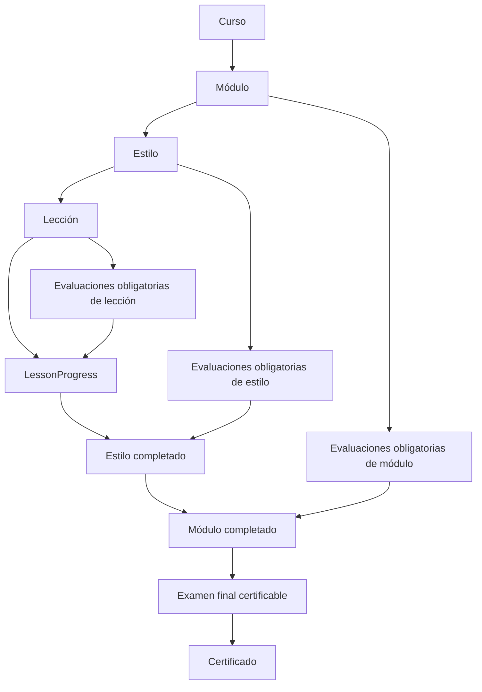

# Recursos y evaluaciones jerárquicos

## Propósito

Los recursos y las evaluaciones ya no están limitados al curso o módulo. Cada elemento pertenece exclusivamente a uno de estos contextos: curso, módulo, estilo o lección. La lección es la única unidad de progreso persistida; los estados de estilo y módulo se calculan a partir de ella y de sus evaluaciones obligatorias.

## Modelo

- `LearningResource` guarda archivo, tipo, tamaño y orden. La migración añade una restricción de base de datos para garantizar un solo padre y que coincida con `scope`.
- `Assessment` tiene el mismo alcance, `isRequired`, nota mínima e intentos base. Solo un `Assessment` de alcance `COURSE` puede ser `isFinalExam`, y debe ser obligatorio.
- `AssessmentQuestion` admite `MULTIPLE_CHOICE`, `WRITTEN`, `PHOTO` y `VIDEO`.
- `AssessmentAttempt` usa `PENDING_REVIEW`, `APPROVED` y `NOT_PASSED`. Las preguntas de selección múltiple se califican automáticamente; cualquier evaluación con respuesta escrita, foto o video pasa a revisión administrativa.
- `AssessmentRevalidation` añade intentos a un estudiante concreto. Solo puede emitirse cuando el último intento está en `NOT_PASSED` y los intentos disponibles se agotaron.

## Reglas de avance

1. Un estudiante puede marcar una lección completada solo después de aprobar todas sus evaluaciones de lección obligatorias.
2. Un estilo está completo si todas sus lecciones y sus evaluaciones obligatorias están aprobadas.
3. Un módulo está completo si sus estilos/lecciones y sus evaluaciones obligatorias están aprobadas.
4. El final se habilita al completar las lecciones y las evaluaciones requeridas de estilo, módulo y curso no-final.
5. Aprobar el final genera el certificado mediante el servicio existente. Un intento manual pendiente no abre el siguiente intento hasta ser corregido. Tras agotar intentos fallidos, la interfaz indica que debe solicitar una revalidación a administración.

Las evaluaciones opcionales nunca alteran el progreso ni la certificación.

## APIs nuevas

Todas las rutas validan el alcance, resuelven el curso asociado y aplican acceso activo del estudiante o rol `ADMIN`:

- `GET|POST /api/admin/learning/:scope/:scopeId/resources`
- `GET /api/student/learning/:scope/:scopeId/resources`
- `DELETE /api/admin/learning/resources/:resourceId`
- `GET|POST /api/admin/learning/:scope/:scopeId/assessments`
- `GET /api/student/learning/:scope/:scopeId/assessments`
- `PATCH|DELETE /api/admin/assessments/:assessmentId`
- `GET /api/student/assessments/:assessmentId`
- `POST /api/student/assessments/:assessmentId/submit`
- `POST /api/admin/assessments/:assessmentId/attempts/:attemptId/review`
- `POST /api/admin/assessments/:assessmentId/revalidations`
- `POST /api/student/lessons/:lessonId/complete`
- `GET /api/student/courses/:courseId/learning-progress`

Las rutas antiguas de recursos, tests y exámenes se conservan temporalmente. La UI nueva usa únicamente las rutas unificadas.

## Migración y compatibilidad

La migración `20260809190640_hierarchical_learning_content` conserva las tablas históricas y copia:

- `CourseResource` y `ModuleResource` a `LearningResource`.
- `ModuleTest`, `CourseTest` y `CourseExam`, junto con preguntas, envíos y respuestas, a las entidades unificadas.

Los exámenes finales heredados se copian como evaluaciones normales, incluso si existía un único candidato. Esto evita emitir certificados desde un final ambiguo y deja a administración seleccionar explícitamente el examen final certificable.

## Interfaz

`LearningContentManager` es el constructor reutilizable del editor administrativo para curso, módulo, estilo y lección. Permite cargar recursos directamente a almacenamiento sin crear filas heredadas y definir preguntas/intententos/tipo de revisión en un único formulario. Las vistas del estudiante muestran recursos solo en su propio contexto y las evaluaciones solo donde corresponden.

## Verificación

- La migración se aplicó y quedó al día en una base temporal PostgreSQL aislada.
- `npx prisma validate`, `npx prisma generate` y `npx tsc --noEmit` se ejecutan para validar modelo y tipos.
- Las pruebas del servicio cubren calificación automática de selección múltiple y el desvío de respuestas escrita/foto/video a revisión manual.
- Antes de producción, probar manualmente la subida de cada tipo de archivo en los cuatro alcances y la entrega de evidencia con un usuario con acceso activo.
