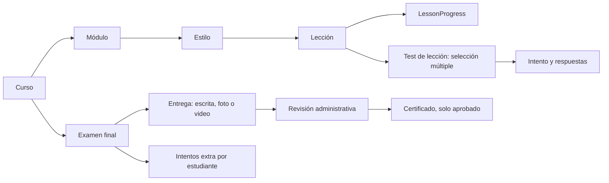

# Diseño: progreso por lección y evaluación final

Fecha: 2026-08-07  
Estado: aprobado para planificación

## Propósito

Reemplazar el progreso académico medido por módulo por un progreso canónico medido por lección. Las lecciones pueden incluir varios tests de selección múltiple, todos necesarios para completar la lección. El curso termina con un único examen final revisado manualmente por administración, con intentos limitados y revalidaciones individuales auditables.

Este diseño elimina los flujos paralelos actuales de `ModuleTest`, `CourseTest` y `CourseExam` como fuente de verdad para el recorrido académico. Los módulos y los estilos conservan su función de organizar el contenido; el avance se deriva de las lecciones.

## Reglas académicas

1. Una lección sin tests se completa mediante una acción explícita del estudiante.
2. Una lección con tests se completa únicamente cuando el estudiante aprueba todos los tests asociados.
3. Cada test de lección usa solo preguntas de selección múltiple y configura de forma independiente la nota mínima y el número máximo de intentos.
4. El porcentaje del curso es `lecciones completadas / lecciones totales`; un módulo se muestra completado cuando todas sus lecciones lo están.
5. El examen final se habilita solo cuando el curso alcanza 100% de sus lecciones y no quedan tests de lección sin aprobar.
6. El examen final admite preguntas escritas y evidencias en foto o video; sus entregas siempre requieren revisión administrativa.
7. Después de enviar el examen final, el estudiante queda bloqueado hasta que administración emita el resultado.
8. Una corrección de "no aprobado" habilita el siguiente intento solo si quedan intentos disponibles.
9. Cuando los intentos se agotan, el estudiante recibe una indicación clara de comunicarse con administración para solicitar revalidación.
10. Administración puede otorgar una cantidad concreta de intentos extra a un estudiante agotado, uno por defecto, sin borrar el historial.
11. Solo una aprobación administrativa del examen final emite el certificado.

## Flujo de datos

### Progreso de lección

`LessonProgress` es la fuente única de verdad, identificada por `userId + lessonId`. Guarda si la lección está completada y cuándo ocurrió. El servicio de progreso calcula, sin persistir duplicados, los estados del módulo y del curso.

### Tests de lección

`LessonTest` pertenece a una lección y puede coexistir con otros tests de esa misma lección. Sus preguntas son exclusivamente de selección múltiple. `LessonTestSubmission` guarda todos los intentos, el resultado, la puntuación y las respuestas. Cada test cuenta sus propios intentos.

Los tests publicados después de que un estudiante completó la lección no revocan su avance. Se aplican a las completaciones posteriores; el sistema conserva el logro histórico de quien ya la había superado.

### Examen final

Cada curso tiene un solo `FinalExam`. Sus preguntas pueden ser escritas, solicitar una foto o solicitar un video. `FinalExamAttempt` es inmutable después de enviarse y tiene estados propios: `PENDING_REVIEW`, `APPROVED` y `NOT_PASSED`.

Una entrega pendiente bloquea cualquier nuevo envío. Una entrega aprobada bloquea definitivamente el examen y dispara la emisión idempotente del certificado. Una entrega no aprobada permite el siguiente intento solo si el cupo efectivo no se agotó.

### Revalidación

`FinalExamRevalidation` registra el estudiante, el examen, la cantidad de intentos concedidos, quien los autorizó, el motivo opcional y la fecha. El límite efectivo de un estudiante es el límite base del examen más la suma de sus revalidaciones. Solo se concede cuando el estudiante está agotado, sin entrega pendiente y sin haber aprobado.

## Experiencia de usuario

### Estudiante

- En el curso ve la cantidad y el porcentaje de lecciones completadas, así como el avance derivado de cada módulo.
- En el reproductor, una lección se marca manualmente si no contiene tests; si contiene tests, explica qué tests faltan y no permite completarla hasta aprobarlos todos.
- Cada test muestra la calificación, los intentos usados y los restantes.
- El examen final muestra uno de cinco estados: bloqueado, disponible, pendiente de revisión, agotado o aprobado.
- El estado agotado no ofrece un botón de reintento: explica que debe comunicarse con administración para solicitar revalidación.
- Cuando administración concede una revalidación, el estudiante recibe una notificación y el examen pasa nuevamente a disponible.

### Administración

- El editor de lecciones incorpora una sección para crear, editar y eliminar tests de selección múltiple, con preguntas, opciones, respuesta correcta, nota mínima e intentos.
- El curso tiene una única sección de examen final, separada de las lecciones, para definir preguntas y el formato de respuesta requerido.
- La cola de revisión muestra respuestas escritas y evidencia multimedia, el número de intento, la decisión y el comentario de corrección.
- La vista del participante agotado permite conceder un número concreto de intentos extra y dejar un motivo. El historial de intentos y revalidaciones siempre se conserva.

## Estados de curso para dashboard

| Estado | Condición |
| --- | --- |
| `IN_PROGRESS` | Faltan lecciones por completar. |
| `READY_FOR_FINAL` | Todas las lecciones están completadas y el examen puede presentarse. |
| `PENDING_REVIEW` | Hay un examen final enviado y pendiente de administración. |
| `EXHAUSTED` | El último resultado fue no aprobado y no quedan intentos efectivos. |
| `COMPLETED` | Administración aprobó el examen final y existe certificado válido. |

El dashboard mostrará lecciones completadas en lugar de módulos completados. Las métricas de intentos, aprobación y certificados se calcularán desde los modelos canónicos nuevos.

## API y contratos previstos

Los nombres exactos se determinarán en el plan, pero los contratos deben cubrir:

- Lectura de progreso por curso, módulo y lección del estudiante autenticado.
- Acción para completar manualmente una lección sin tests.
- CRUD administrativo de tests de lección y sus preguntas de selección múltiple.
- Consulta y envío de tests de lección, con resultado e intentos restantes.
- CRUD administrativo del único examen final por curso y sus preguntas escritas, de foto o video.
- Consulta de elegibilidad, estado y envío del examen final.
- Cola de entregas finales y acción administrativa para aprobar o marcar como no aprobado, con comentario.
- Acción administrativa de revalidación por estudiante agotado.
- Consulta de historial de examen final, intentos y revalidaciones para administración; el estudiante solo ve su propio historial.

Todos los contratos mutables exigirán autorización de rol y acceso vigente al curso. El servidor, no la interfaz, resuelve la elegibilidad, el límite de intentos, el estado pendiente y la emisión del certificado.

## Migración y compatibilidad

1. La migración crea los modelos canónicos sin borrar datos antiguos.
2. Para cada `ModuleProgress` existente con `completed = true`, se crean progresos completados para las lecciones actuales del módulo. Los módulos incompletos no otorgan progreso de lecciones por inferencia.
3. Los tests históricos de módulo o de curso que no puedan asociarse con seguridad a una lección se conservan como historial. Administración debe asignarlos explícitamente a su lección destino o recrearlos antes de volver a publicarlos.
4. Si existe un examen final legado, se migra al único examen final del curso cuando sus preguntas y respuestas sean compatibles; de lo contrario se conserva en modo histórico y se recrea desde administración.
5. Las rutas y pantallas antiguas dejan de ser fuente de verdad y se retiran del recorrido activo después de migrar las pantallas consumidoras.

## Seguridad y manejo de fallos

- Toda operación verifica sesión, rol, pertenencia entre recurso y curso, y vigencia del acceso.
- La creación de intentos finales y las decisiones de revisión se ejecutan transaccionalmente para impedir dobles envíos, intentos fuera de cupo o reaperturas prematuras.
- Los archivos solicitados por el examen se validan según el tipo y tamaño configurados por la pregunta; una carga fallida no consume intento.
- La aprobación y el certificado son idempotentes. Un error al enviar correo o notificación no revierte una aprobación ni la emisión del PDF.
- La migración se valida antes de exponer el flujo nuevo; no debe dejar un curso en un estado de progreso parcial.

## Verificación

Se añadirán pruebas de integración y unitarias para:

- Cálculo de progreso por lección, módulo derivado y curso.
- Completado manual de lecciones sin tests.
- Tests de lección de selección múltiple: puntuación, límite de intentos, bloqueo y desbloqueo de la lección.
- Elegibilidad del examen final solo al completar el 100%.
- Estados `PENDING_REVIEW`, `NOT_PASSED`, `EXHAUSTED`, revalidado y aprobado.
- Revisión de administración, conservación del historial y autorización por rol.
- Prevención de envíos simultáneos y de intentos que superen el cupo.
- Validación de archivos de foto/video y recuperación ante fallos de carga.
- Migración del avance histórico y emisión única de certificados.

## Decisiones críticas

- Los estilos continúan siendo agrupaciones de contenido y no una frontera de acceso ni de progreso.
- No se mide tiempo de video ni se guarda una posición de reproducción; el avance es explícito por lección y condicionado por los tests cuando existan.
- El examen final no se autocorrige: administración tiene la decisión definitiva sobre aprobación, habilitación del siguiente intento y certificación.
- Revalidar añade cupo individual y preserva el historial; no reinicia ni borra intentos anteriores.
