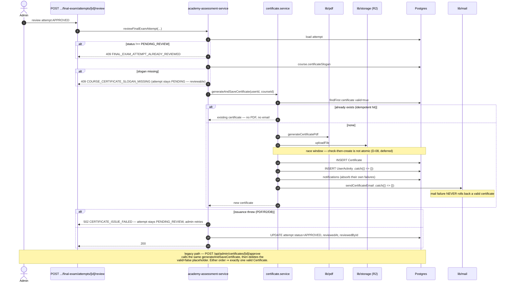

# Design: Complete the Course Module

**Phase**: sdd-design · **Change**: `complete-course-module` · **Store**: openspec
**Inputs**: `proposal.md` (Owner Decisions D1–D7 are FIXED), `explore.md`, `openspec/project-context.md`
**Delivery**: `exception-ok` — ONE PR, ~1800 lines against an 800-line budget, owner-accepted (D5)

> Engram MCP unreachable this session (`uv_spawn`). This file is the persisted artifact for
> topic `sdd/complete-course-module/design`.

---

## 1. Technical Approach

Four additive read-side surfaces plus one additive table. No existing write path moves, no data
migration, no legacy surface removed.

| Workstream | Strategy |
| --- | --- |
| WS0 tests | Characterization first, against unmodified production code. Blocks WS1–WS4. |
| WS1 attempts | Mirror `FinalExamRevalidation` into `LessonTestRevalidation`; add ONE read-side aggregation service that normalizes three attempt systems into one row shape. |
| WS2 analytics | New learning-metrics service (Prisma aggregates); extend `MarketingAnalyticsService.getCourseAnalytics` with an optional `courseId` filter. |
| WS3 chat | Extract the data layer into a hook, then add an opt-in `defaultOpen` prop; new "my courses" endpoint feeds a collapsed sidebar group. |
| WS4 certificate | Tests only. A real concurrency defect is documented and deliberately deferred (see D-08). |

**Layering held**: services own all Prisma access; routes stay thin with inline Zod, `getAdminUser()`
guards, and central custom-error mapping; admin panels are client components with `fetch` + local state.

---

## 2. Exploration corrections (verified this phase)

Three exploration claims were wrong or incomplete. They change scope; treat this section as
authoritative over `explore.md`.

| Claim in `explore.md` | Verified reality | Impact |
| --- | --- | --- |
| "no `ChatWidget` in `src/app/(marketing)/learn/[courseId]/page.tsx`" | **False.** `ChatWidget` is mounted at `learn/[courseId]/page.tsx:115`, and also at `components/academy/LearningUnitPlayer.tsx:264`. A full-page course chat already exists at `learn/[courseId]/chat/page.tsx` using `ChatPanel`. | Students already have per-course chat. WS3 shrinks to default-open + sidebar. Sidebar links reuse the existing `/learn/{id}/chat` page — no new page. |
| "`ModuleTest` / `CourseTest` appear dead" | **False.** 36 files reference them. Live proof: `learn/[courseId]/page.tsx:17,18,63` renders `courseTests`; `api/modules/[moduleId]/progress/route.ts:75-102` gates module completion on `moduleTest`/`moduleSubmission`, and `:20-24` reads `courseTest`/`courseExam` before minting a placeholder certificate. | They stay untouched, and the Attempts tab + learning analytics **explicitly exclude** them with a visible UI note. Recorded as a follow-up change. |
| "certificate idempotency should prevent duplicates" | Sequentially yes; **concurrently no.** `certificate.service.ts` does `findFirst` (:24) → PDF generate → R2 upload → `create` (:67). The window is seconds wide and there is no unique constraint on `(userId, courseId)`. | See D-08. Not fixed in this PR, for a reason that is itself a design finding. |

---

## 3. Architecture Decisions

### D-01 — `LessonTestRevalidation`: mirror, do not unify

| | |
| --- | --- |
| **Choice** | New model mirroring `FinalExamRevalidation` field-for-field. No unique constraint on `(lessonTestId, userId)` — grants accumulate and are summed. |
| **Rejected** | (a) Migrate `LessonTest` onto `Assessment(scope=LESSON)` — needs a data migration and touches student test-taking routes (proposal non-goal). (b) A generic polymorphic `Revalidation(targetType, targetId)` table — loses FK integrity and cascade behaviour, which is the only thing the two existing tables get right. |
| **Rationale** | Third instance of a pattern proven twice. Additive-only, so rollback is a forward `DROP TABLE`. A unique constraint would contradict D7: multiple grants must sum, exactly as `_sum.attemptsGranted` already does for the other two. |

**Deliberate deviation from the `postgresql` skill**: the skill prefers `snake_case`, `timestamptz`,
and `BIGINT GENERATED ALWAYS AS IDENTITY`. This table uses Prisma defaults — quoted `PascalCase`,
`TEXT` cuid PK, `TIMESTAMP(3)` — because Prisma owns the DDL and `prisma migrate diff` compares
against ~50 sibling tables built that way. A single divergent table would produce permanent drift
noise and a mixed-type schema, which is a larger hazard than the timezone nuance on an audit-only
grant timestamp. Where the skill does apply and is followed: **all three FK columns get explicit
indexes** (PostgreSQL does not auto-index FKs), `NOT NULL` on every semantically required column,
and explicit `ON DELETE` on every constraint.

### D-02 — One aggregation service, not three composed in the route

| | |
| --- | --- |
| **Choice** | New `src/server/services/course-attempts-service.ts` exporting `listBlockedStudents(courseId): Promise<BlockedAttemptRow[]>`, returning a normalized union row. |
| **Rejected** | Three service functions composed inside the route handler. |
| **Rationale** | Composition-in-route would put the blocked-predicate, the effective-cap formula, and the cross-system merge into a route handler, breaking the project's thin-route convention and leaving the logic untestable at the unit layer. One service = one unit test file = one place where the cap formula lives. The route stays ~15 lines. |

### D-03 — Three grant endpoints, not one polymorphic endpoint

| | |
| --- | --- |
| **Choice** | Keep `POST /api/admin/assessments/[assessmentId]/revalidations` and `POST /api/admin/courses/[courseId]/final-exam/revalidations` unchanged. Add exactly one: `POST /api/admin/lessons/[lessonId]/tests/[testId]/revalidations`. The Attempts tab dispatches on `row.system` using the `grantEndpoint` string the service already computed. |
| **Rejected** | A polymorphic `POST /api/admin/courses/[courseId]/attempts/grants` with `{ system, targetId, userId }`. |
| **Rationale** | The proposal requires the existing per-panel grant actions in `LearningContentManager` and `FinalExamManager` to keep working, so a polymorphic endpoint would be a **fourth** surface, not a replacement — strictly more code. It would also have to reimplement two different guard shapes (`getAdminUser()` for the final exam vs. the scope-aware guard for assessments) inside one switch. Three narrow endpoints and one client-side map is less total surface and no new auth logic. **Revisit if a fourth attempt system appears.** |

### D-04 — Effective cap and blocked predicate, unified

One formula, applied identically in all three systems and in both the service and the UI:

```
attemptsAllowed = target.maxAttempts + Σ revalidations.attemptsGranted   // for (target, user)
blocked         = attemptsUsed >= attemptsAllowed AND NOT passed
```

`passed` per system: `Assessment` → any attempt `status = APPROVED`; `LessonTest` → any submission
`isPassed = true`; `FinalExam` → any attempt `status = APPROVED`.

`grantLessonTestRevalidation` mirrors `grantFinalExamRevalidation`'s precondition, with one
documented translation: the final exam requires the latest attempt to be `NOT_PASSED` (it is manually
reviewed and can sit `PENDING_REVIEW`); a lesson test is auto-scored, so the equivalent is "latest
submission exists and `isPassed = false`". Same intent, no `PENDING_REVIEW` state to wait on.

### D-05 — Learning analytics: Prisma aggregates, not raw SQL

| | |
| --- | --- |
| **Choice** | New `src/server/services/course-learning-analytics-service.ts` using `count` / `aggregate` / `groupBy`. Marketing stays raw SQL. |
| **Rejected** | Raw `$queryRaw` for symmetry with `marketing-analytics-service.ts`. |
| **Rationale** | The marketing service uses raw SQL because `PageView` course attribution needs `split_part("path", '/', 3)` and `COUNT(DISTINCT "sessionId")`, which Prisma cannot express. The learning metrics are plain counts and averages over indexed FK columns — fully expressible in Prisma, so raw SQL would trade type safety for nothing. |

**Metric definitions** (D6 is binding on completion rate):

| Metric | Definition | Note |
| --- | --- | --- |
| `enrolledStudents` | `CourseAccess` count with `buildActiveCourseAccessWhere()` | reuses the existing helper |
| `completedStudents` | distinct users with a **valid** `Certificate` for the course | see caveat below |
| `completionRate` | `completedStudents / enrolledStudents`, `0` when enrolled is `0` | **D6**: students-over-students, NOT lessons-over-total |
| `averageScore` | `{ assessment: number \| null, lessonTest: number \| null }` | per system — see D-06 |
| `attempts` | `{ assessment, lessonTest, finalExam }` raw counts | lifetime, not range-scoped |
| `passRate` | per system: approved-or-passed ÷ total attempts | `null` when zero attempts |
| `blockedStudents` | distinct user count from `listBlockedStudents(courseId)` | **reuses D-02**, never a second definition |

**Caveat, must surface in the UI**: completion is read from issued certificates because that is the
only single row meaning "finished this course" for *both* issuance paths. A course with no final exam
and no certificate flow reports `0`. The panel labels it "según certificados emitidos". The rejected
alternative — recomputing `getCourseLearningProgress` per student — is exactly the N+1 that already
makes `/api/admin/courses/[courseId]/students` slow (`students/route.ts:34-52`, ~4 queries × N).
Reusing `blockedStudents` from the same service the tab uses is deliberate: two independent
definitions of "blocked" would drift, and the admin would see one number in the tab and another in
the panel.

### D-06 — Average score is reported per system, never pooled

| | |
| --- | --- |
| **Choice** | Two averages (`Assessment`, `LessonTest`). The final exam reports `passRate` only, no score. |
| **Rejected** | One pooled average across all three. |
| **Rationale** | `FinalExamAttempt` **has no score column** (`schema.prisma:1359-1378`) — it is a manual APPROVED/NOT_PASSED decision. `Assessment.score` is `Float?` and null for manually reviewed attempts; `LessonTestSubmission.score` is always populated. Pooling a nullable auto-grade with a pass/fail decision is a category error that yields a number no admin can act on. Two honest numbers beat one meaningless one. |

### D-07 — Chat: extract the data hook first, keep presentation duplicated

| | |
| --- | --- |
| **Choice** | Extract `useChatRoom(roomId)` into `src/app/components/useChatRoom.ts` — messages state, 3s polling, image upload, send, mention token, error/loading. Then add `defaultOpen?: boolean` to `ChatWidget`. Presentation JSX stays separate. |
| **Rejected** | (a) `defaultOpen` with no refactor. (b) Unify both components into one variant-driven component. |
| **Rationale** | The hook is ~90 net-new lines but deletes ~110 duplicated lines from the two components, so it is roughly **size-neutral** against the accepted `size:exception` — and it is the difference between fixing polling/scroll once instead of twice. The drift is already real: `ChatPanel` has `isAtBottomRef` scroll anchoring (`ChatPanel.tsx:57,101-106`) that `ChatWidget` lacks. (b) is rejected because a 320px fixed floating panel and a full-height column are genuinely different layouts; merging them produces a variant mega-component that is worse than the duplication. `ChatWidget` also resolves `roomId` from `courseId` while `ChatPanel` receives it as a prop — that resolution stays in `ChatWidget` as a second tiny hook, `useCourseChatRoom(courseId)`. |

`defaultOpen` is **opt-in per call site**, defaulting to `false`:

| Call site | `defaultOpen` | Why |
| --- | --- | --- |
| `CourseAdminTabs.tsx:98` (chat tab) | `true` | D3 |
| `learn/[courseId]/page.tsx:115` | `true` | D3 |
| `LearningUnitPlayer.tsx:264` | `false` (unchanged) | It is a video player. A 460px panel over the video is a regression, and D3 names only the course view. |

### D-08 — Certificate: prove the sequential invariant, defer the concurrent fix

| | |
| --- | --- |
| **Choice** | No production change. Integration test proves exactly one `Certificate` for both firing orders. The concurrency race is recorded as a known defect with a named follow-up and an `it.todo` in the suite. |
| **Rejected** | Adding `@@unique([userId, courseId])` in this PR. |
| **Rationale** | A **plain** unique constraint would break the working legacy path. `api/modules/[moduleId]/progress/route.ts:30-38` creates a `valid: false` placeholder, and `api/admin/certificates/[id]/approve/route.ts:69-70` generates the real certificate **before** deleting that placeholder — so two rows legitimately share `(userId, courseId)` for the duration of the approve call. The correct fix is a **partial** unique index, `CREATE UNIQUE INDEX ... ON "Certificate"("userId","courseId") WHERE "valid" = true`, which Prisma cannot express in `schema.prisma` and needs a hand-written migration plus a drift story. That is a second migration with its own shape, in a PR already at 2.25× budget. Deferring it is a scope call, not an oversight — and the race requires two admins approving inside the PDF-generation window, so likelihood is low while the cost of getting the constraint wrong is a broken legacy path. |

**If the owner wants it in this PR**, the design is: partial unique index in a second additive
migration, `create` wrapped in a `P2002` catch that re-reads and returns the winner, and a
concurrent-issuance integration test. That is ~80 more lines and a second rollback surface.

### D-09 — Analytics date range: fixed default + three presets; learning metrics are lifetime

| | |
| --- | --- |
| **Choice** | Marketing metrics default to a 30-day window with 7/30/90-day preset buttons. Learning metrics are lifetime and labelled as such. |
| **Rejected** | (a) A full date-range picker. (b) A single fixed window with no control. |
| **Rationale** | Marketing metrics are meaningless without a window, and the aggregation already takes `{ from, to }` via `parseAnalyticsDateRange`. A full picker is new UI surface against an exceeded budget; three preset buttons are ~10 lines. Learning metrics are deliberately **not** windowed: attempts and completion are cumulative, and windowing them would make the completion rate move for reasons the admin cannot explain (a student who enrolled last year and finished this month would drop out of both numerator and denominator inconsistently). |

### D-10 — Sidebar: collapsed group, capped at 8, with admin bypass parity

| | |
| --- | --- |
| **Choice** | One "Chats de curso" row that expands to the list. Capped at 8 visible with a "Ver todos" link. Hidden entirely when empty. Collapsed by default. |
| **Rejected** | (a) A flat list of every course. (b) A hard cap with no expansion. |
| **Rationale** | `Sidebar.tsx:153` puts `<nav>` in `overflow-y-auto` inside a fixed 280px column that also holds `NotificationsNavItem` and the account footer. A flat list is fine at 1–3 courses and silently pushes Notificaciones and "Cerrar sesión" out of reach at 10+. Collapsed-by-default costs one `useState` and preserves the exact current sidebar height for every existing user. |

The backing endpoint mirrors the **admin bypass already in `api/chat/rooms/[courseId]/route.ts:45-59`**
so the sidebar never shows an entry the room endpoint would reject, and never hides one it would allow:

| Role | Query |
| --- | --- |
| `STUDENT` / `STAFF` | `courseAccess.findMany({ where: { userId, ...buildActiveCourseAccessWhere() }, select: { course: { select: { id, title } } } })` |
| `ADMIN` | `course.findMany({ where: { isActive: true }, select: { id, title } })` |

Client-side it is a `CourseChatNavItems` sub-component doing `fetch` in `useEffect` — the pattern
`NotificationsNavItem` (`Sidebar.tsx:64-104`) already establishes. **No polling**: course access does
not change mid-session in a way worth a 30s interval. Entries link to the existing
`/learn/{courseId}/chat` page, so no new page is created. `MobileDrawer` (`nav: NavItem[]`) needs the
group too, or mobile silently loses it — one extra prop.

---

## 4. Data Model

```
                 Lesson ──1:N── LessonTest ──1:N── LessonTestSubmission ──1:N── LessonTestAnswer
                                     │                        │
                                     │ 1:N                    │ N:1
                                     ▼                        ▼
              ┌──────────────────────────────────┐          User
              │  LessonTestRevalidation  (NEW)   │           ▲  ▲
              │──────────────────────────────────│  userId   │  │ grantedById
              │  id              TEXT  PK  cuid  │───────────┘  │  (RESTRICT)
              │  lessonTestId    TEXT  FK CASCADE│──────────────┘
              │  userId          TEXT  FK CASCADE│
              │  grantedById     TEXT  FK RESTRICT
              │  attemptsGranted INTEGER NOT NULL│   no UNIQUE — grants accumulate
              │  reason          TEXT NULL       │
              │  createdAt       TIMESTAMP(3) now│
              │──────────────────────────────────│
              │  idx (lessonTestId, userId)      │  ← the aggregate's access path
              │  idx (grantedById)               │  ← FK index; PG does not auto-create
              └──────────────────────────────────┘

     Structural twins, unchanged:
       AssessmentRevalidation  (schema.prisma:1073)  → Assessment
       FinalExamRevalidation   (schema.prisma:1396)  → FinalExam
```

### Prisma model

```prisma
model LessonTestRevalidation {
  id              String   @id @default(cuid())
  lessonTestId    String
  userId          String
  grantedById     String
  attemptsGranted Int
  reason          String?
  createdAt       DateTime @default(now())

  lessonTest LessonTest @relation(fields: [lessonTestId], references: [id], onDelete: Cascade)
  student    User       @relation("LessonTestRevalidationStudent",   fields: [userId],      references: [id], onDelete: Cascade)
  grantedBy  User       @relation("LessonTestRevalidationGrantedBy", fields: [grantedById], references: [id])

  @@index([lessonTestId, userId])
  @@index([grantedById])
}
```

Two back-relation edits are required or `prisma validate` fails:
`LessonTest.revalidations LessonTestRevalidation[]` (near `schema.prisma:1266`), and on `User`
(alongside `:192-193`) `lessonTestRevalidations` / `lessonTestGrants`.

### Migration SQL approach

`npx prisma migrate dev --name lesson_test_revalidation`. Review the generated file; it must contain
**only** these statements and nothing else:

```sql
CREATE TABLE "LessonTestRevalidation" (
    "id" TEXT NOT NULL,
    "lessonTestId" TEXT NOT NULL,
    "userId" TEXT NOT NULL,
    "grantedById" TEXT NOT NULL,
    "attemptsGranted" INTEGER NOT NULL,
    "reason" TEXT,
    "createdAt" TIMESTAMP(3) NOT NULL DEFAULT CURRENT_TIMESTAMP,
    CONSTRAINT "LessonTestRevalidation_pkey" PRIMARY KEY ("id")
);
CREATE INDEX "LessonTestRevalidation_lessonTestId_userId_idx" ON "LessonTestRevalidation"("lessonTestId", "userId");
CREATE INDEX "LessonTestRevalidation_grantedById_idx" ON "LessonTestRevalidation"("grantedById");
ALTER TABLE "LessonTestRevalidation" ADD CONSTRAINT "LessonTestRevalidation_lessonTestId_fkey"
  FOREIGN KEY ("lessonTestId") REFERENCES "LessonTest"("id") ON DELETE CASCADE ON UPDATE CASCADE;
ALTER TABLE "LessonTestRevalidation" ADD CONSTRAINT "LessonTestRevalidation_userId_fkey"
  FOREIGN KEY ("userId") REFERENCES "User"("id") ON DELETE CASCADE ON UPDATE CASCADE;
ALTER TABLE "LessonTestRevalidation" ADD CONSTRAINT "LessonTestRevalidation_grantedById_fkey"
  FOREIGN KEY ("grantedById") REFERENCES "User"("id") ON DELETE RESTRICT ON UPDATE CASCADE;
```

This matches `prisma/migrations/20260807161313_lesson_progress_assessments/migration.sql:121-131,
176-179, 221-227` exactly in shape. **Additive-only, no backfill, no `ALTER`/`DROP` of an existing
object.** If `migrate dev` emits anything else, the working-tree schema has drifted and apply must
stop. Cascades: deleting a lesson test or a student removes their grants (grants are meaningless
without the target); `grantedById` is `RESTRICT` so an admin account cannot be deleted while it still
carries audit rows — identical to both existing tables.

**Rollback**: application revert alone is safe — the table becomes unused and `submitLessonTest`
returns to counting `maxAttempts` only, so granted students lose the extra attempts but no submission
or score is lost. Schema rollback is a **new forward migration** `DROP TABLE "LessonTestRevalidation"`,
never a hand-edit of the applied file, and after a backup: the rows are admin grant decisions that
cannot be reconstructed.

---

## 5. Interfaces

```ts
// src/server/services/course-attempts-service.ts
export type AttemptSystem = 'ASSESSMENT' | 'LESSON_TEST' | 'FINAL_EXAM'

export type BlockedAttemptRow = {
  system: AttemptSystem
  targetId: string                    // assessmentId | lessonTestId | finalExamId
  targetTitle: string
  scopeLabel: string                  // 'Curso' | 'Módulo: X' | 'Estilo: X' | 'Lección: X'
  student: { id: string; name: string | null; email: string | null }
  attemptsUsed: number
  attemptsAllowed: number             // maxAttempts + Σ attemptsGranted
  lastAttemptAt: Date | null
  lastStatus: string | null           // NOT_PASSED | PENDING_REVIEW | null
  grantEndpoint: string               // ready-to-POST path, chosen by `system`
}

export function listBlockedStudents(courseId: string): Promise<BlockedAttemptRow[]>

// src/server/services/academy-assessment-service.ts  (additions)
export function grantLessonTestRevalidation(
  grantedById: string, lessonId: string, testId: string,
  userId: string, attemptsGranted: number, reason?: string | null
): Promise<LessonTestRevalidation>   // throws AcademyAssessmentError('REVALIDATION_NOT_AVAILABLE', 409)

// src/server/services/course-learning-analytics-service.ts
export type CourseLearningAnalytics = {
  enrolledStudents: number
  completedStudents: number
  completionRate: number                                   // 0-100, 0 when enrolled === 0
  averageScore: { assessment: number | null; lessonTest: number | null }
  attempts:     { assessment: number; lessonTest: number; finalExam: number }
  passRate:     { assessment: number | null; lessonTest: number | null; finalExam: number | null }
  blockedStudents: number
}
export function getCourseLearningAnalytics(courseId: string): Promise<CourseLearningAnalytics>

// src/server/services/marketing-analytics-service.ts  (signature widened, backward compatible)
static getCourseAnalytics({ from, to, courseId }: DateRange & { courseId?: string })

// src/app/components/useChatRoom.ts
export function useChatRoom(roomId: string | null): {
  messages: ChatMessage[]; text: string; setText: (v: string) => void
  pendingImage: File | null; pendingPreview: string | null
  selectImage: (e: React.ChangeEvent<HTMLInputElement>) => void
  removePending: () => void; appendMention: (u: ChatMessage['user']) => void
  send: (e: React.FormEvent) => Promise<void>
  sending: boolean; initialLoading: boolean; error: string | null
  messagesEndRef: React.RefObject<HTMLDivElement>
  fileInputRef: React.RefObject<HTMLInputElement>
}
export function useCourseChatRoom(courseId: string): { roomId: string | null; noAccess: boolean }
```

Error contract, unchanged from the existing convention: services throw
`AcademyAssessmentError(code, message, status)` / `LearningContentError(...)`; routes map them
centrally to `NextResponse.json({ success: false, error, code }, { status })`, with `z.ZodError` →
`400` and an unrecognised error → `console.error` + `500`. Never swallow: the new
`grantLessonTestRevalidation` propagates its typed error rather than returning `null`.

**Response envelope**: the new `/api/admin/courses/[courseId]/analytics` returns
`{ success, data }` to match its `/api/admin/courses/**` namespace and what `CourseAdminTabs` already
parses — **not** the `{ ok, data }` used by `/api/admin/analytics/*` (`analytics/utils.ts:31`). That
inconsistency is pre-existing; do not propagate it and do not "fix" it here.

---

## 6. Data Flow

### 6.1 Unified attempts listing and grant

```mermaid
sequenceDiagram
    autonumber
    actor Admin
    participant Tab as CourseAdminTabs (Attempts)
    participant R1 as GET /api/admin/courses/[id]/attempts
    participant S as course-attempts-service
    participant DB as Postgres
    participant R2 as POST .../revalidations
    participant AS as academy-assessment-service

    Admin->>Tab: open "Intentos" tab
    Tab->>R1: fetch
    R1->>R1: getAdminUser() — 403 if not ADMIN
    R1->>S: listBlockedStudents(courseId)
    par three systems, fixed query count
        S->>DB: assessments (course OR module OR style OR lesson)
        S->>DB: assessmentAttempt.groupBy(assessmentId,userId)
        S->>DB: approved attempts + revalidation.groupBy _sum
    and
        S->>DB: lessonTests for course
        S->>DB: lessonTestSubmission.groupBy(lessonTestId,userId)
        S->>DB: passed submissions + lessonTestRevalidation.groupBy _sum
    and
        S->>DB: finalExam + attempt.groupBy(userId) + revalidation.groupBy _sum
    end
    S->>DB: user.findMany({ id: { in: blockedUserIds } })  %% one lookup, all systems
    S-->>R1: BlockedAttemptRow[]  (used >= allowed AND NOT passed)
    R1-->>Tab: { success: true, data }

    Admin->>Tab: click "Habilitar 1 intento" on a row
    Tab->>R2: POST row.grantEndpoint { userId, attemptsGranted: 1, reason }
    R2->>R2: getAdminUser() + inline Zod parse
    R2->>AS: grantLessonTestRevalidation(...)
    AS->>DB: re-check used >= allowed AND NOT passed
    alt precondition fails
        AS-->>R2: AcademyAssessmentError REVALIDATION_NOT_AVAILABLE
        R2-->>Tab: 409 { success:false, error, code }
        Tab-->>Admin: sonner error toast, row unchanged
    else ok
        AS->>DB: INSERT LessonTestRevalidation (cap +1; D7 — no reset, no score discarded)
        R2-->>Tab: 201 { success:true, data }
        Tab->>R1: refetch
        Tab-->>Admin: success toast, row disappears
    end
```

### 6.2 Final exam pass → certificate → email, including failure paths



---

## 7. File Changes

### Created

| File | Purpose |
| --- | --- |
| `prisma/migrations/<ts>_lesson_test_revalidation/migration.sql` | Additive table + 2 indexes + 3 FKs |
| `src/server/services/course-attempts-service.ts` | `listBlockedStudents` — the D-02 aggregation |
| `src/server/services/course-learning-analytics-service.ts` | `getCourseLearningAnalytics` — D-05 metrics |
| `src/app/api/admin/lessons/[lessonId]/tests/[testId]/revalidations/route.ts` | LessonTest grant; clones the final-exam route's shape |
| `src/app/api/admin/courses/[courseId]/attempts/route.ts` | `GET` — feeds the Attempts tab |
| `src/app/api/admin/courses/[courseId]/analytics/route.ts` | `GET ?from&to` — `{ marketing, learning }` |
| `src/app/api/student/my-courses/route.ts` | Sidebar course list, admin bypass (D-10) |
| `src/app/(dashboard)/admin/courses/components/CourseAttemptsPanel.tsx` | Attempts tab body |
| `src/app/(dashboard)/admin/courses/components/CourseAnalyticsPanel.tsx` | Inline recharts + presets |
| `src/app/components/useChatRoom.ts` | `useChatRoom` + `useCourseChatRoom` (D-07) |
| `src/server/services/__tests__/academy-assessment-service.test.ts` | WS0 characterization |
| `src/server/services/__tests__/certificate-service.test.ts` | WS0 characterization |
| `src/server/services/__tests__/course-attempts-service.test.ts` | D-02/D-04 unit |
| `src/server/services/__tests__/course-learning-analytics-service.test.ts` | D-05/D-06 unit |
| `src/app/api/admin/courses/__tests__/course-attempts.integration.test.ts` | Aggregation + grant, real DB |
| `src/app/api/admin/certificates/__tests__/dual-issuance.integration.test.ts` | WS4, D-08 |

### Modified

| File | Change |
| --- | --- |
| `prisma/schema.prisma` | New model; `LessonTest.revalidations`; two `User` back-relations |
| `src/server/services/academy-assessment-service.ts` | `grantLessonTestRevalidation`; `getStudentLessonTests` and `submitLessonTest` count `maxAttempts + Σ grants` |
| `src/server/services/marketing-analytics-service.ts` | `getCourseAnalytics` takes optional `courseId` (backward compatible) |
| `src/app/(dashboard)/admin/courses/[courseId]/edit/CourseAdminTabs.tsx` | New `intentos` tab; `analiticas` renders the panel and drops the `/admin/analytics` anchor (`:83-88`); `<ChatWidget defaultOpen />` |
| `src/app/(marketing)/learn/[courseId]/page.tsx` | `<ChatWidget courseId defaultOpen />` at `:115` |
| `src/app/components/ChatWidget.tsx` | Consume the hooks; add `defaultOpen?: boolean` (default `false`) |
| `src/app/components/ChatPanel.tsx` | Consume `useChatRoom`; keep its own layout and scroll anchoring |
| `src/app/(dashboard)/components/Sidebar.tsx` | `CourseChatNavItems` collapsed group for `STUDENT_NAV`/`STAFF_NAV` |
| `src/app/(dashboard)/components/mobile/MobileDrawer.tsx` | Render the same group so mobile keeps parity |
| `src/server/services/__tests__/learning-content-service.test.ts` | Extend with `grantAssessmentRevalidation` + cap formula |

### Explicitly left alone

`LegacyCourseEditorPage.tsx` · `ModuleTest` / `CourseTest` / `CourseExam` models and their ~30 routes
(**live**, §2) · `api/admin/certificates/[id]/approve/route.ts` (D2) · `api/modules/[moduleId]/progress/route.ts`
· `certificate.service.ts` (D-08) · `LearningContentManager.tsx` / `FinalExamManager.tsx` per-panel grants
(must keep working) · `components/academy/LearningUnitPlayer.tsx` (D-07) · `/api/admin/analytics/courses`
· `LessonTestManager.tsx` — the Attempts tab supersedes a per-panel list; do not build both.

---

## 8. Testing Strategy

`strict_tdd: true`. `academy-assessment-service.ts` has **zero** coverage today, so WS0 lands first
and must pass against **unmodified** production code. Established conventions: `vi.mock('@/lib/db', ...)`
with hand-rolled model stubs (`achievement-service.test.ts:10-31`); integration tests create and
`finally`-delete their own fixtures against the real DB (`course-structure-integrity.integration.test.ts`).

| Layer | File | Proves |
| --- | --- | --- |
| Unit (WS0, first) | `academy-assessment-service.test.ts` | `submitLessonTest` throws `LESSON_TEST_ATTEMPTS_EXHAUSTED` at `used >= maxAttempts`; `LESSON_TEST_ALREADY_PASSED`; `grantFinalExamRevalidation` refuses unless exhausted **and** latest is `NOT_PASSED`; `reviewFinalExamAttempt` issues the certificate **before** the status update and leaves the attempt `PENDING_REVIEW` when issuance throws; `COURSE_CERTIFICATE_SLOGAN_MISSING` is 409 |
| Unit (WS0, first) | `certificate-service.test.ts` | `generateAndSaveCertificate` returns the existing valid certificate without calling `generateCertificatePdf`; a rejected `sendCertificateEmail` still resolves and still returns the certificate (the `.catch(() => {})` guard) |
| Unit (WS0, extend) | `learning-content-service.test.ts` | `grantAssessmentRevalidation` rejects when `attempts.length < maxAttempts + Σ grants`, and when the latest attempt is not `NOT_PASSED`; `attemptsGranted < 1` rejected |
| Unit (WS1) | `course-attempts-service.test.ts` | The blocked predicate for all three systems; the cap formula sums multiple grants; a passed student is never blocked at any attempt count; a course with no attempts returns `[]`; `grantEndpoint` matches `system` |
| Unit (WS1) | `academy-assessment-service.test.ts` (extend) | `grantLessonTestRevalidation` precondition; `getStudentLessonTests`/`submitLessonTest` admit an attempt after a grant, and D7 — the prior failed submission and score survive |
| Unit (WS2) | `course-learning-analytics-service.test.ts` | D6 completion rate; `enrolled === 0` → `0`, not `NaN`/divide-by-zero; per-system average score with the final exam absent (D-06); an empty course returns all zeroes rather than throwing |
| Integration (WS1) | `course-attempts.integration.test.ts` | End to end over a real DB: seed a blocked student in each of the three systems, `GET` returns all three rows, `POST` the LessonTest grant, re-`GET` shows the row gone and `attemptsAllowed` incremented; non-admin gets 403 |
| Integration (WS4) | `dual-issuance.integration.test.ts` | **Order A** automatic → manual, **Order B** manual → automatic, and the automatic path fired twice — each asserts `certificate.count({ userId, courseId }) === 1`, that the survivor is the `valid` one, and that no placeholder is orphaned. `it.todo('rejects concurrent duplicate issuance')` records the D-08 gap in the suite, not in a comment |

Mock `@/lib/pdf`, `@/lib/storage`, and `@/lib/mail` in the certificate integration test — no R2 or SMTP
from a test run. UI panels are not unit-tested: there is no component-test infrastructure (no RTL, no
Playwright), and adding one is out of scope. `npm test` · `npm run test:db:setup && npm run test:integration`
· `npm run typecheck && npm run lint`.

---

## 9. Performance Notes

**Attempts aggregation — the N+1 trap and how it is avoided.** The naive shape is "for each student,
sum their grants for this assessment", which is `O(students × assessments)` queries. Instead the
service issues a **fixed ~13 queries regardless of student or attempt count**: per system, one target
lookup, one `groupBy(targetId, userId)` for `_count` and `_max(submittedAt)`, one passed-set
`findMany`, and one `revalidation.groupBy(targetId, userId) _sum(attemptsGranted)`; then a single
`user.findMany({ id: { in: blockedUserIds } })` shared across all three systems, issued last so it
only loads users that are actually blocked. Grouping and joining happen in memory over sets whose
size is bounded by attempt count, not by a query per row.

Every access path is already indexed: `AssessmentAttempt @@index([assessmentId, userId, status])`,
`AssessmentRevalidation @@index([assessmentId, userId])`, `LessonTestSubmission @@index([lessonTestId, userId])`,
`FinalExamAttempt @@index([finalExamId, userId, status])`, and the two new `LessonTestRevalidation`
indexes. The `IN` lists are bounded by per-course assessment/test counts (tens), not by users.

**Explicitly not reused**: `/api/admin/courses/[courseId]/students` (`students/route.ts:34-52`) runs
`getCourseLearningProgress` **per student** inside a `Promise.all` — roughly `4 × N` queries. It is an
existing hot spot; neither the Attempts tab nor the analytics panel may call it. Fixing it is out of
scope but worth a follow-up.

**Learning analytics**: 8 Prisma aggregates under one `Promise.all`, all on indexed FK columns.
**Marketing**: two raw scans of `PageView` and `Payment` filtered by `createdAt`/`paidAt` **plus** the
new `courseId` predicate, which makes the scoped call strictly cheaper than the existing all-courses
one. The `split_part("path", '/', 3)` course attribution stays untouched — it is unindexable and
couples analytics to the `/courses/{courseId}` path shape; the spec must document that coupling.

**Chat**: `useChatRoom` keeps the existing 3s poll unchanged; two components now share one
implementation, so the interval count per mounted widget does not change. `defaultOpen` does start
polling on mount where it previously waited for a click — on exactly two pages, each with one widget.

---

## 10. Threat Matrix

**N/A** — this change introduces no routing (in the command/agent sense), shell command, subprocess,
version-control automation, PR automation, executable-file classification, or process-integration
boundary. It adds HTTP route handlers guarded by the existing `getAdminUser()` / session checks, a
Prisma table, and React components. Per the reference: *"If the change has no routing/shell/process
boundary, record the matrix as not applicable rather than expanding it."*

The genuine security surface is **auth-adjacent**, flagged by the proposal and reviewed as normal
application logic, not as a threat-matrix row:

| Surface | Requirement |
| --- | --- |
| `GET /api/admin/courses/[courseId]/attempts` · `analytics` · new grant route | `getAdminUser()` first; 403 before any DB read. Blocked-student rows expose student names and emails. |
| `GET /api/student/my-courses` | Returns only the caller's own active `CourseAccess`; admin bypass mirrors `chat/rooms/[courseId]:45-59` exactly. Never accepts a `userId` parameter. |
| Sidebar entries | Presence of an entry must never grant access — `/api/chat/rooms/[courseId]` remains the sole authority and re-checks on every open. |

---

## 11. Migration / Rollout

1. Merge behind the normal `feature/*` → `dev` → `staging` → `main` flow. No direct pushes; `AGENT.md`
   requires Plan Mode plus explicit human approval before production code changes.
2. `prisma migrate deploy` on staging first. The table is additive and empty; zero downtime, no lock
   on an existing table.
3. Smoke on staging: open the Attempts tab on a course with a blocked student in each system; grant
   once on a LessonTest; confirm the student can submit again and the prior score survived (D7).
4. Verify the `analiticas` zero state on a course with no views, no purchases, and no attempts.
5. No feature flag. Every surface is admin-visible or additive-nav; there is nothing to dark-launch.
6. **Rollback**: revert the application commit. The table becomes unused; granted students lose the
   extra attempts but no submission or score is lost. Schema rollback, only if required, is a new
   forward `DROP TABLE` migration after a backup — never a hand-edit of an applied migration.

---

## 12. Resolved and Open Questions

### Resolved in this design

| Question | Resolution |
| --- | --- |
| Analytics date range | D-09 — 30-day default, 7/30/90 presets for marketing; learning metrics are lifetime and labelled so |
| Average score pooled or per system | D-06 — per system; the final exam has no score column, so pooling is a category error |
| Sidebar scale | D-10 — collapsed group, cap 8, "Ver todos", hidden when empty |
| Legacy `ModuleTest` / `CourseTest` | **NOT dead** (§2, verified). Untouched, and explicitly excluded from the Attempts tab and analytics with a visible UI note |
| One grant endpoint or three | D-03 — three; a polymorphic one would be a fourth surface, not a replacement |
| Aggregation shape | D-02 — one service, normalized union row; D-04 — one cap formula everywhere |
| Chat refactor vs. size budget | D-07 — extract the data hook; ~size-neutral and removes a live drift hazard |

### Resolved by owner (2026-09-01)

| Question | Resolution |
| --- | --- |
| D-08 concurrency | **Fix now.** Add the partial unique index (`WHERE "valid" = true`) as a second migration with raw SQL. The forward-only migration closes the real race — not just the sequential invariant — and its rollback is a plain `DROP INDEX`, recorded alongside the WS1 migration's rollback plan. Budget ~80 extra lines against the accepted `size:exception`. |
| Completion-rate proxy | **Accept the `0%` reading for courses with no final exam / no certificate flow**, surfaced with the existing UI label clarifying the metric is certificate-based. No second definition, no lessons-completed fallback. |
| `LessonTestManager` blocked list | **Unified Attempts tab only.** Do not add a per-panel blocked-students list to `LessonTestManager`. It stays the single source of truth for blocked students across all three systems (D4), avoiding a duplicated predicate. |

These three are now FIXED inputs for `sdd-tasks` and `sdd-apply`; do not reopen them.
