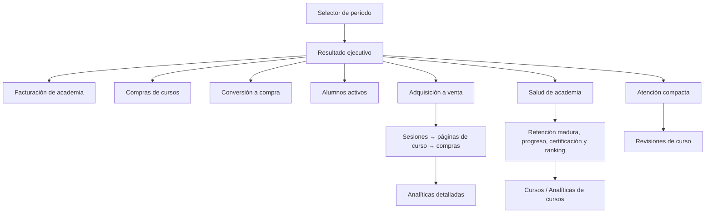
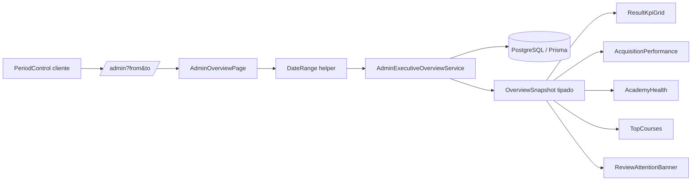

# Especificación 09: Overview ejecutivo de Website + Academia

**Estado:** implementado y verificado con pruebas unitarias, migración temporal y consultas reales.

## 1. Propósito y alcance

El overview de `/admin` dejará de ser un inventario de métricas de marketing y LMS. Será una lectura ejecutiva que permita a un administrador entender, en menos de un minuto, si el negocio digital está creciendo, qué parte del recorrido explica ese resultado y qué revisión puede desbloquear valor inmediato.

El alcance está limitado a **website y academia**. Las citas, pagos de salón y links de pago no se recuperan en esta pantalla, aunque los modelos y rutas sigan existiendo.

### Historia de usuario

Como administrador, quiero abrir `/admin` y ver el rendimiento comercial y académico del período elegido para decidir si debo profundizar en adquisición, conversión, un curso concreto o una revisión pendiente, sin navegar por bloques analíticos irrelevantes.

### Criterios de aceptación

- [x] El período por defecto es 30 días; se puede cambiar a 7, 90 o un rango personalizado.
- [x] Todos los bloques usan el mismo período y comparan contra el período inmediatamente anterior de igual duración.
- [x] El primer vistazo contiene solamente: facturación académica, compras, conversión a compra y alumnos activos.
- [x] El overview visualiza el recorrido sesiones → visitas de curso → compras y el estado de salud de la academia.
- [x] Las revisiones pendientes de certificados aparecen como una sola franja accionable, subordinada a los KPIs de resultado.
- [x] Ninguna métrica de citas, reservas, pagos de salón ni links de pago se muestra aquí.
- [x] Las métricas detalladas permanecen accesibles desde Analíticas, Cursos y Revisiones conservando el rango seleccionado.
- [x] Los estados sin datos, datos parciales, errores de sección y monedas múltiples son explícitos y no producen agregados engañosos.

## 2. Diseño de información

La página se organiza en este orden:

1. **Cabecera:** título, fecha de actualización, selector de período y acceso a Analíticas.
2. **Bloque de resultado:** frase breve basada en variaciones disponibles y cuatro KPI cards.
3. **Adquisición a venta:** tendencia diaria de sesiones y compras, seguida de un embudo de tres etapas.
4. **Salud de academia:** retención a 30 días de cohortes maduras, progreso medio, tiempo a certificación y tres cursos por facturación.
5. **Atención:** una franja visible únicamente cuando existen revisiones que bloquean certificados.

Se retiran del overview —sin eliminarlos del producto— fuentes, campañas, páginas, dispositivos, navegadores, geografía, distribución de roles, conteo de contenido, calidad de bugs y el desglose exhaustivo de evaluaciones. Esos datos pertenecen a las vistas especializadas.

## 3. Contrato de datos

Todos los rangos se interpretan con la zona horaria configurable del negocio. `from` representa el inicio del día local y `to` el final completo del día local. El período comparativo es el intervalo contiguo anterior de la misma longitud. Esto sustituye la semántica actual, que puede omitir eventos del último día al interpretar `to` a medianoche.

| Métrica | Definición | Fuente de verdad | Destino de detalle |
|---|---|---|---|
| Facturación de academia | Suma bruta cobrada por cursos pagados en el período, por moneda. El rótulo deja claro que no es ingreso neto ni incluye salón. | `Payment` con `type=COURSE`, `status=PAID` y `paidAt` dentro del rango. | `/admin/analytics/conversions` con `scope=academy` |
| Compras de cursos | Cantidad de los pagos anteriores. | `Payment` | Mismo destino |
| Conversión a compra | Compras de cursos ÷ sesiones únicas del website. | `Payment` + `PageView` | `/admin/analytics/conversions` |
| Alumnos activos | Usuarios autenticados con actividad de aprendizaje o visita a contenido de cursos dentro del rango. | `UserActivity` y `PageView` de `/learn/*` o `/courses/*` | `/admin/analytics/courses` |
| Embudo | Sesiones únicas → sesiones con página de curso → compras de curso. | `PageView` + `Payment` | `/admin/analytics/conversions` |
| Retención 30 días | Usuarios de una matrícula con al menos 30 días de antigüedad que vuelven a realizar actividad de aprendizaje dentro de sus primeros 30 días. | `CourseAccess`, `UserActivity`, `PageView` | `/admin/analytics/courses` |
| Progreso medio | Módulos completados ÷ módulos asignados para accesos vigentes. | `ModuleProgress`, `Module`, `CourseAccess` | `/admin/analytics/courses` |
| Tiempo a certificarse | Mediana de días entre acceso de curso y certificado válido. | `CourseAccess`, `Certificate` | `/admin/analytics/courses` |
| Ranking de cursos | Tres cursos ordenados por compras confirmadas del período; muestra facturación separada por moneda, certificados y conversión del curso. | `Payment`, `Course`, `Certificate`, `PageView` | `/admin/analytics/courses?courseId=…` |
| Atención | Cantidad de exámenes y evaluaciones finales pendientes que pueden desbloquear certificados. | `ExamSubmission`, `CourseTestSubmission` | `/admin/courses/review` |

### Cambios de modelo y consistencia

`Payment.createdAt` registra el inicio del checkout, no el momento de cobro. Para evitar medir ventas en el período equivocado se añade:

- `Payment.paidAt: DateTime?`, establecido una sola vez al confirmar el webhook de Stripe.
- Índice compuesto de consulta por `type`, `status` y `paidAt`.
- `ConversionEvent.paymentId: String? @unique` para hacer idempotente la atribución creada por el webhook. Los eventos de registro pueden conservar `paymentId=null`.

El webhook actualiza el pago a `PAID`, fija `paidAt` y crea/actualiza su evento de conversión en una única transacción. Una reentrega de Stripe no podrá sumar de nuevo una compra o su importe.

El backfill de `paidAt` usa el primer `ConversionEvent` de compra que referencia de forma inequívoca el `paymentId`. Los pagos históricos sin esa evidencia permanecen con fecha desconocida y no se inventan dentro de una serie temporal.

## 4. Arquitectura y componentes

- `AdminOverviewPage` queda como server component protegido por `protectAdminPage`; no realiza consultas de negocio directamente.
- `DateRange` centraliza presets, validación, zona horaria, rango anterior y serialización de query string. También se reutiliza en Analíticas.
- `AdminExecutiveOverviewService` devuelve un `OverviewSnapshot` tipado: rango, comparación, resultado, embudo, salud académica, ranking, atención y estado de disponibilidad por bloque.
- Las consultas requeridas se agrupan por intención y se ejecutan en paralelo. El objetivo es reemplazar las decenas de consultas y secciones actuales por un conjunto pequeño de agregados ejecutivos.
- `PeriodControl` es el único componente cliente: actualiza `from/to` en la URL. El resto recibe datos server-side, evitando fetches en cascada.
- No se agrega un endpoint público. La ruta `/admin` consume el servicio internamente; las rutas analíticas existentes conservan su autenticación y reciben `from`, `to` y, cuando corresponde, `scope=academy`.

## 5. Interacciones y estados

### Navegación

- Cada KPI es un enlace semántico a su análisis especializado con el período actual preservado.
- El gráfico y embudo llevan a Conversiones; las filas de curso a Analítica de cursos filtrada; la atención a Revisiones.
- Si no hay revisiones, no se reserva un panel vacío: la franja desaparece.

### Estados de datos

- **Sin datos:** muestra valor cero contextual, explicación del origen esperado y sin delta ni titular concluyente.
- **Datos insuficientes para comparación:** muestra el valor actual y `Sin período comparable`.
- **Error parcial:** la sección afectada muestra `No disponible ahora`; los demás bloques permanecen operativos. El error se registra en servidor.
- **Rango inválido:** se rechaza `from > to`, fechas inválidas y rangos superiores al límite definido; la página conserva el último rango válido.
- **Monedas múltiples:** se muestran importes separados por moneda. No se convierte ni suma sin una regla contable explícita.

## 6. Seguridad, rendimiento y accesibilidad

- La página y cualquier detalle de analítica continúan restringidos a `ADMIN`; no se exponen datos mediante API sin `checkAdminAuth`.
- La pantalla no muestra correos, nombres de alumnos ni identificadores de pago.
- Los gráficos incluyen valores y etiquetas equivalentes para lectores de pantalla; las tendencias no dependen solo del color.
- En móvil los KPIs pasan a dos columnas y luego una; el embudo se apila y las acciones conservan un área táctil amplia.
- Se usa una estrategia de degradación por bloque (`Promise.allSettled` o resultado tipado) y un `error` boundary del segmento para no perder por completo el overview ante una consulta fallida.

## 7. Validación y pruebas

- [x] Pruebas unitarias del servicio: los ingresos y compras incluyen solo `COURSE + PAID`, y excluyen citas, links, pendientes, cancelados y reembolsos.
- [x] Pruebas de fecha: el día final completo se incluye y el comparativo es de igual duración.
- [ ] Pruebas de cohortes: la retención a 30 días excluye alumnos con menos de 30 días desde la matrícula.
- [x] Pruebas del webhook: la reentrega del mismo checkout no duplica la venta ni la conversión atribuida.
- [ ] Pruebas de autorización: usuario anónimo y no ADMIN no acceden a `/admin` ni a detalles protegidos.
- [x] Pruebas de estados: cero datos, datos sin período previo, sección fallida y más de una moneda.
- [ ] Prueba de integración de navegación: los enlaces conservan `from/to` y el alcance académico.
- [ ] Revisión manual: escritorio, tablet, móvil, foco de teclado, contraste y lectura con datos incompletos.

## 8. Plan de implementación

- [x] Crear migración para `Payment.paidAt`, `ConversionEvent.paymentId` y sus índices; aplicar backfill determinista.
- [x] Hacer idempotente la confirmación de Stripe y garantizar que la transición a `PAID` fija `paidAt` una vez.
- [x] Extraer el helper de rangos y corregir la semántica inclusiva de las Analíticas existentes.
- [x] Implementar y probar `AdminExecutiveOverviewService` con su contrato tipado y agregados de negocio.
- [x] Reemplazar `src/app/(dashboard)/admin/page.tsx` por la composición ejecutiva y componentes presentacionales acotados.
- [x] Conectar enlaces de detalle, selector de período y estados de degradación.
- [ ] Completar pruebas específicas de autorización, cohorte y navegación, además de revisión responsive manual autenticada.
- [x] Actualizar la documentación de arquitectura y el manual administrativo cuando la implementación esté verificada.

## 9. Decisiones críticas

- El usuario aprobó mantener el overview exclusivamente en website + academia.
- El resultado de negocio domina la jerarquía: acciones pendientes permanecen accesibles, no compiten con el rendimiento.
- La fuente de verdad para facturación y compras es el pago de curso confirmado, no la analítica genérica que mezcla conversiones de otros módulos.
- La retención solo usa cohortes que ya pueden completar la ventana que se declara.
- La precisión temporal y la idempotencia del webhook son requisitos de producto, no detalles de presentación.

## 10. No objetivos

- Reintroducir la operación de citas, pagos de salón o links de pago en `/admin`.
- Sustituir las vistas detalladas de Analíticas o Cursos.
- Convertir el overview en un sistema contable de ingresos netos o conversión de divisas.
- Añadir tiempo real, polling continuo o alertas externas.
